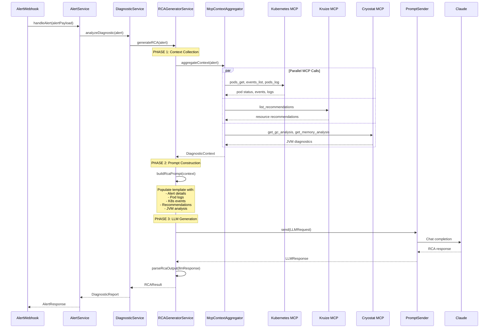

# RCA Generation Architecture

## Overview

LLM-based Root Cause Analysis generation following hexagonal architecture. Collects context from multiple MCP servers, aggregates into structured format, and generates RCA via LLM.

## Architecture Diagram

```mermaid
flowchart TB
    subgraph PRIMARY["Primary Adapter (Inbound)"]
        API[AlertWebhookController<br/>POST /api/v1/webhooks/alerts]
    end

    subgraph CORE["Core Domain"]
        AS[AlertService]
        DS[DiagnosticService]
        RCAGEN[RCAGeneratorService<br/><b>NEW</b>]
        
        subgraph PORTS["Secondary Ports"]
            CTXPORT[ContextAggregator<br/>interface]
            LLMPORT[PromptSender<br/>interface]
        end
    end

    subgraph SECONDARY["Secondary Adapters (Outbound)"]
        CTXIMPL[McpContextAggregator<br/><b>NEW</b><br/>@ApplicationScoped]
        LLMIMPL[LangChainPromptSender<br/>existing]
        
        subgraph MCP["MCP Servers"]
            K8S[Kubernetes MCP<br/>pods, events, logs]
            KRUIZE[Kruize MCP<br/>recommendations]
            CRYO[Cryostat MCP<br/>JVM diagnostics]
        end
    end

    API --> AS
    AS --> DS
    DS --> RCAGEN
    
    RCAGEN --> CTXPORT
    RCAGEN --> LLMPORT
    
    CTXPORT -.impl.-> CTXIMPL
    LLMPORT -.impl.-> LLMIMPL
    
    CTXIMPL --> K8S
    CTXIMPL --> KRUIZE
    CTXIMPL --> CRYO
    
    LLMIMPL --> LLM[Claude/Bob/Ollama]
```

## Flow Sequence



## Component Details

### 1. Core Domain Models

**Location**: `src/main/java/com/causa/core/domain/`

```java
// DiagnosticContext - Aggregated context from all MCP servers
public record DiagnosticContext(
    Alert alert,
    KubernetesContext kubernetesContext,
    KruizeContext kruizeContext,
    CryostatContext cryostatContext,
    Instant collectedAt
) {}

// RCARequest - Input to RCA generation
public record RCARequest(
    String alertId,
    DiagnosticContext context
) {}

// RCAResult - Output from RCA generation
public record RCAResult(
    String alertId,
    String rootCause,
    String recommendation,
    int confidence,
    List<String> evidenceSources,
    Instant generatedAt
) {}
```

### 2. Secondary Port (Interface)

**Location**: `src/main/java/com/causa/core/ports/mcp/`

```java
/**
 * Context aggregation port.
 * Implementations collect context from MCP servers.
 */
public interface ContextAggregator {
    /**
     * Aggregate diagnostic context from all available MCP servers.
     */
    DiagnosticContext aggregateContext(Alert alert);
}
```

### 3. Secondary Adapter (Implementation)

**Location**: `src/main/java/com/causa/mcp/`

```java
@ApplicationScoped
public class McpContextAggregator implements ContextAggregator {
    
    @Inject
    McpContextCollector mcpCollector; // existing
    
    @Inject
    KubernetesMcpClient k8sClient; // NEW
    
    @Inject
    KruizeMcpClient kruizeClient; // NEW
    
    @Inject
    CryostatMcpClient cryostatClient; // NEW (optional)
    
    @Override
    public DiagnosticContext aggregateContext(Alert alert) {
        // Parallel collection from all MCP servers
        CompletableFuture<KubernetesContext> k8sFuture = 
            CompletableFuture.supplyAsync(() -> collectK8sContext(alert));
        
        CompletableFuture<KruizeContext> kruizeFuture = 
            CompletableFuture.supplyAsync(() -> collectKruizeContext(alert));
        
        CompletableFuture<CryostatContext> cryostatFuture = 
            CompletableFuture.supplyAsync(() -> collectCryostatContext(alert));
        
        // Wait for all
        CompletableFuture.allOf(k8sFuture, kruizeFuture, cryostatFuture).join();
        
        return new DiagnosticContext(
            alert,
            k8sFuture.join(),
            kruizeFuture.join(),
            cryostatFuture.join(),
            Instant.now()
        );
    }
}
```

### 4. Core Service

**Location**: `src/main/java/com/causa/core/services/`

```java
@ApplicationScoped
public class RCAGeneratorService {
    
    @Inject
    ContextAggregator contextAggregator; // port injection
    
    @Inject
    PromptSender promptSender; // port injection
    
    @Inject
    RCAPromptTemplate promptTemplate; // NEW
    
    public RCAResult generateRCA(Alert alert) {
        // 1. Collect context from all MCP servers
        DiagnosticContext context = contextAggregator.aggregateContext(alert);
        
        // 2. Build LLM prompt from template
        String prompt = promptTemplate.render(context);
        
        // 3. Call LLM
        LLMRequest llmRequest = LLMRequest.builder(prompt)
            .systemPrompt("You are an expert diagnostic engineer...")
            .temperature(0.2)
            .maxTokens(4096)
            .build();
        
        LLMResponse llmResponse = promptSender.send(llmRequest);
        
        // 4. Parse response
        return parseRcaResponse(alert.getAlertId(), llmResponse);
    }
}
```

## MCP Context Structure

### Kubernetes Context

```java
public record KubernetesContext(
    String podName,
    String namespace,
    String phase,
    String containerState,
    List<String> events,
    List<String> logs,
    ResourceUsage resourceUsage
) {}

public record ResourceUsage(
    String cpuUsage,
    String memoryUsage,
    String cpuLimit,
    String memoryLimit
) {}
```

### Kruize Context

```java
public record KruizeContext(
    List<ResourceRecommendation> recommendations,
    String costAnalysis
) {}

public record ResourceRecommendation(
    String resourceType, // CPU, MEMORY
    String currentValue,
    String recommendedValue,
    String impact
) {}
```

### Cryostat Context (Optional - Future)

```java
public record CryostatContext(
    GcAnalysis gcAnalysis,
    MemoryAnalysis memoryAnalysis,
    ThreadAnalysis threadAnalysis
) {}
```

## RCA Prompt Template

**Location**: `src/main/resources/prompts/rca-generation-prompt.txt`

```text
You are an expert diagnostic engineer analyzing a Kubernetes Java application alert.

# Alert Details
- Alert Name: {{alertName}}
- Severity: {{severity}}
- Pod: {{podName}}
- Namespace: {{namespace}}
- Timestamp: {{timestamp}}
- Description: {{description}}

# Pod Status
{{podStatus}}

# Kubernetes Events
{{kubernetesEvents}}

# Pod Logs (Last 100 lines)
{{podLogs}}

# Resource Usage
- CPU: {{cpuUsage}} / {{cpuLimit}}
- Memory: {{memoryUsage}} / {{memoryLimit}}

# Kruize Recommendations
{{kruizeRecommendations}}

{{#if cryostatAvailable}}
# JVM Analysis (Cryostat)
## GC Analysis
{{gcAnalysis}}

## Memory Analysis
{{memoryAnalysis}}
{{/if}}

---

Based on the above context, provide a comprehensive root cause analysis:

1. **Root Cause**: What is the primary cause of this issue?
2. **Evidence**: What specific evidence supports this conclusion?
3. **Recommendation**: What actions should be taken to resolve this?
4. **Confidence**: How confident are you in this analysis? (0-100)

Format your response as:
ROOT_CAUSE: [your analysis]
EVIDENCE: [supporting evidence from logs/metrics]
RECOMMENDATION: [actionable steps]
CONFIDENCE: [0-100]
```

## Extensibility

### Adding New MCP Server

1. Create new context record in `core/domain/`
2. Create MCP client in `mcp/clients/`
3. Update `McpContextAggregator` to collect from new server
4. Update `DiagnosticContext` to include new context
5. Update RCA prompt template to use new context

### Example: Adding Cryostat

```java
// 1. Domain model
public record CryostatContext(...) {}

// 2. MCP client
@ApplicationScoped
public class CryostatMcpClient {
    public CryostatContext getJvmAnalysis(Alert alert) {
        // Call Cryostat MCP tools
    }
}

// 3. Update aggregator
public class McpContextAggregator {
    public DiagnosticContext aggregateContext(Alert alert) {
        // Add Cryostat collection
        CompletableFuture<CryostatContext> cryoFuture = ...
    }
}

// 4. Update DiagnosticContext record
public record DiagnosticContext(
    ...,
    CryostatContext cryostatContext // NEW
) {}

// 5. Update prompt template
# JVM Analysis
{{cryostatContext.gcAnalysis}}
```

## Performance Considerations

### Parallel MCP Calls
- All MCP calls execute in parallel via `CompletableFuture`
- Timeout: 5s per MCP server (configurable)
- Circuit breaker: Fail fast if MCP server unavailable

### Caching
- Cache MCP responses for 30s (configurable)
- Cache key: `alert:${alertId}:mcp:${serverName}`

### Token Optimization
- Truncate logs to last 100 lines
- Summarize events if > 20 events
- Compress large JSON responses

## Error Handling

### MCP Server Unavailable
- Continue with partial context
- Mark missing context in prompt: `[Kruize unavailable]`
- LLM works with available context

### LLM Failure
- Retry with exponential backoff (3 attempts)
- Fallback to rule-based RCA if LLM fails
- Log failure metrics

### Timeout Strategy
- MCP collection: 5s per server
- Total RCA generation: 15s max
- Return partial result if timeout

## Testing Strategy

### Unit Tests
- Mock `ContextAggregator` interface
- Test `RCAGeneratorService` with mocked context
- Test prompt template rendering

### Integration Tests
- Mock MCP server responses
- Test full RCA generation flow
- Verify LLM prompt construction

### E2E Tests
- Use real MCP servers (test environment)
- Verify complete alert → RCA flow
- Validate RCA output quality

## Deployment

### Configuration

```yaml
# application.yml
causa:
  rca:
    enabled: true
    timeout-ms: 15000
    mcp:
      parallel: true
      timeout-ms: 5000
    llm:
      temperature: 0.2
      max-tokens: 4096
      model: claude-sonnet-4-6
```

### Feature Flag

```java
@ConfigProperty(name = "causa.rca.enabled", defaultValue = "true")
boolean rcaEnabled;

if (rcaEnabled) {
    generateRCA(alert);
}
```

---

**Status**: ✅ Design Complete  
**Next Steps**: Implement core domain models
